# ID CARD CREATION

## Description

This project is a digitalized solution transforming the process of generating identification cards. It efficiently reduces the time-consuming manual procedures previously reliant on MS Word. With this application, the creation of ID cards is streamlined, eliminating manual tasks and enhancing the overall efficiency of the identification card production process.

⚠️ **Disclaimer**: This is not a complete project. Some code is not included and is intended solely for demonstration purposes as part of a portfolio. You can find the excluded files by checking the [.gitignore](.gitignore) file.

## Technologies Used

- **Backend**: Codeigniter 3 (RESTful)
- **Frontend**: jQuery, Bootstrap
- **Database**: Microsoft SQL Server
- **Authentication**: JWT
- **Pagination**: SQL seek method for paginated tables

## Features

- **On-Site ID Card Registration with Preview**: Register a single ID card on-site, capturing a photo and allowing a preview of the resulting card.
- **Display Registered ID Cards with Search Functionality**: View all ID cards registered through on-site registration and utilize a search function.
- **Bulk Insert or Update for ID Cards**: Enables mass insertion or updates by uploading a file containing new data or corrections for existing records.
- **Individual Update and Deletion**: Allows individual data editing and deletion for greater flexibility.
- **Print ID Cards**: Simplifies the selection of ID cards for printing by optimizing search and selection features.

## Screenshots

### 1. On-Site ID Card Registration with Preview

  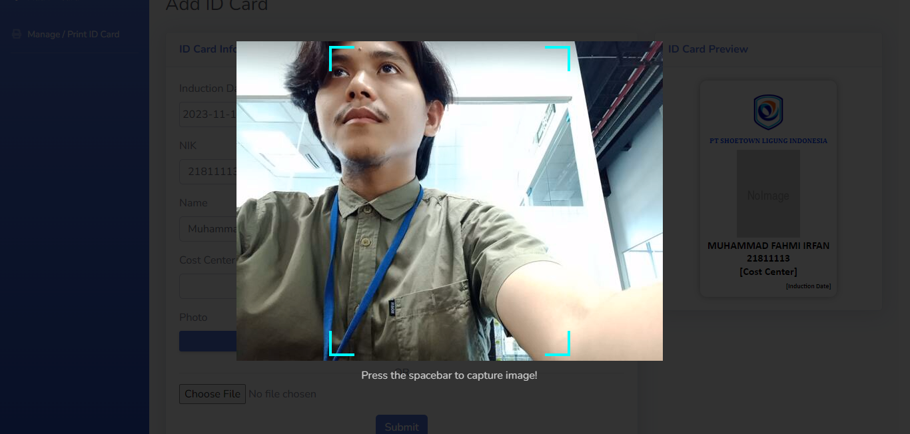
   Image 1.1. - Take a photo

  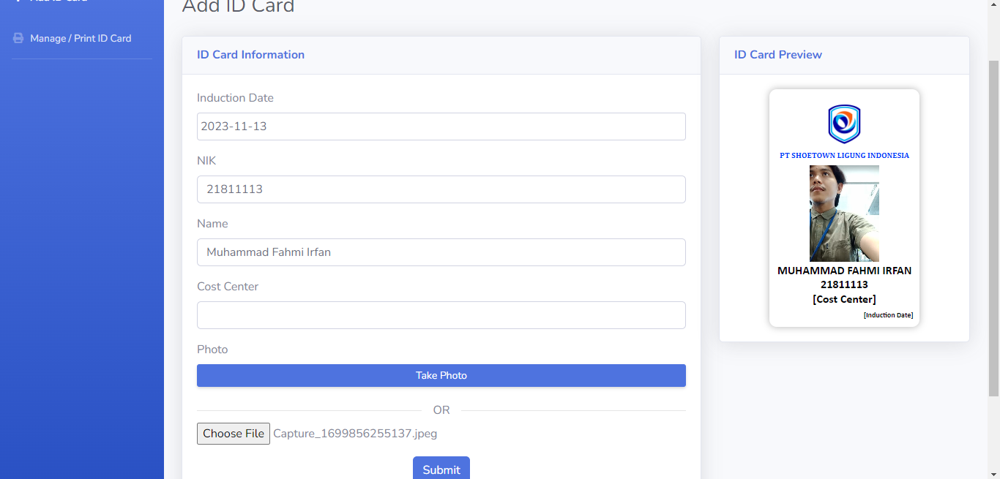
   Image 1.2. - Register and preview id card

### 2. Display Registered ID Cards with Search Functionality

  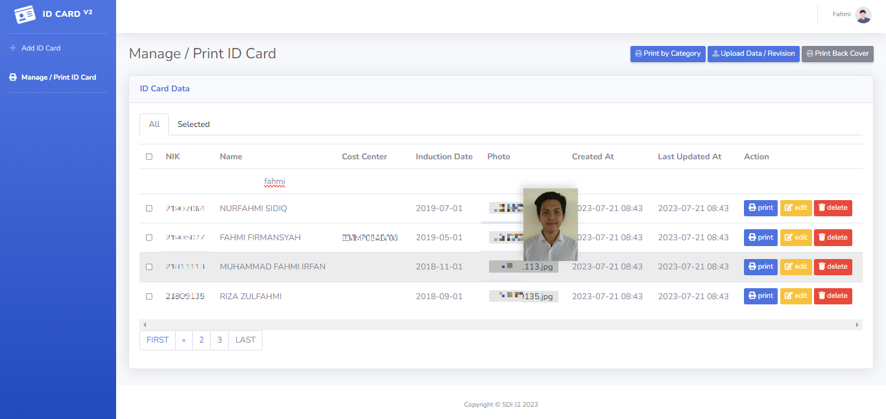
   Image 2. - Display and filter

### 3. Bulk Insert or Update for ID Cards

  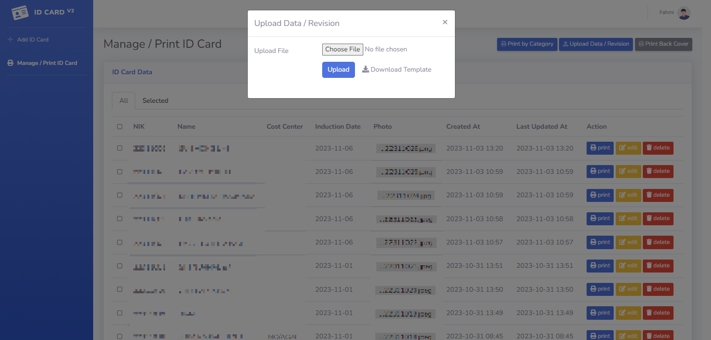
   Image 3.1 - Bulk insert or update

  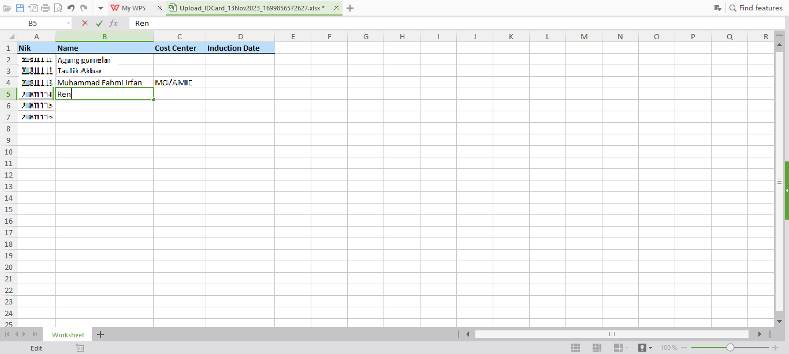
   Image 3.2 - Upload template

### 4. Individual Update and Deletion

  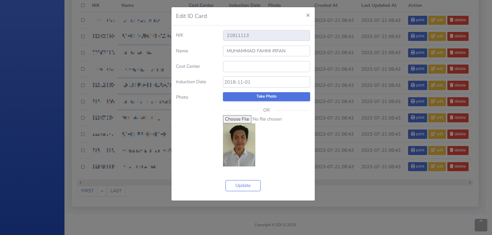
   Image 4.1. - Update

  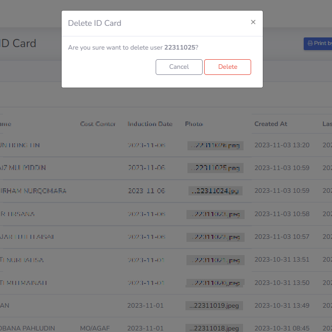
   Image 4.2. - Delete

### 5. Print ID Cards

  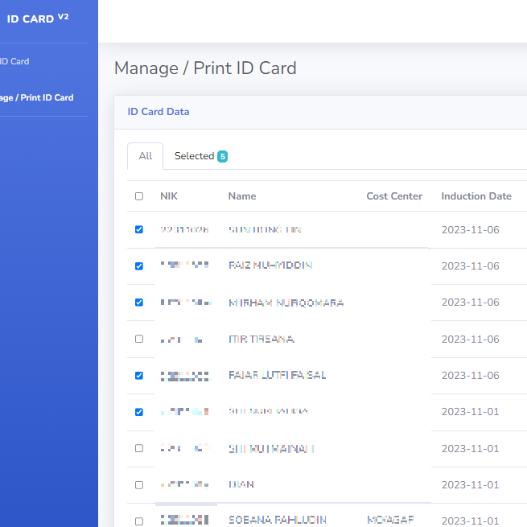
   Image 5.1. - Select data

  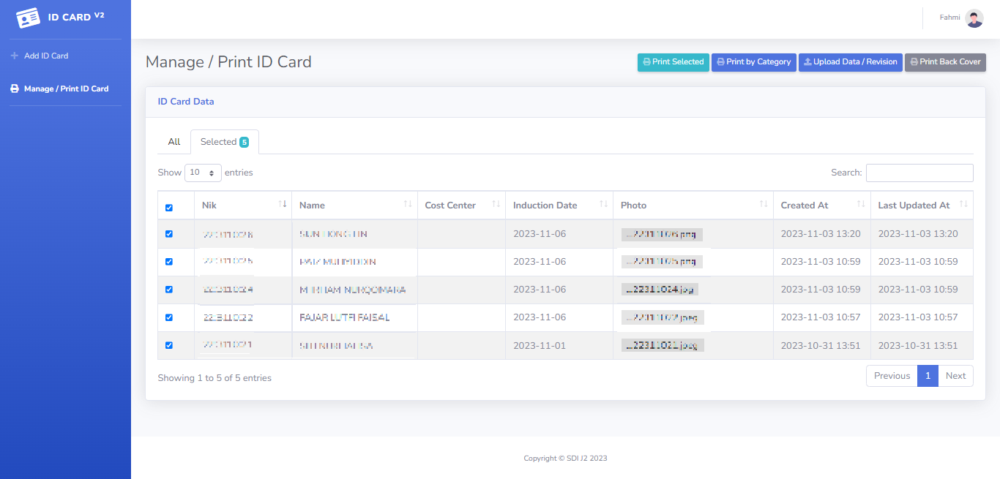
   Image 5.2. - Selected

  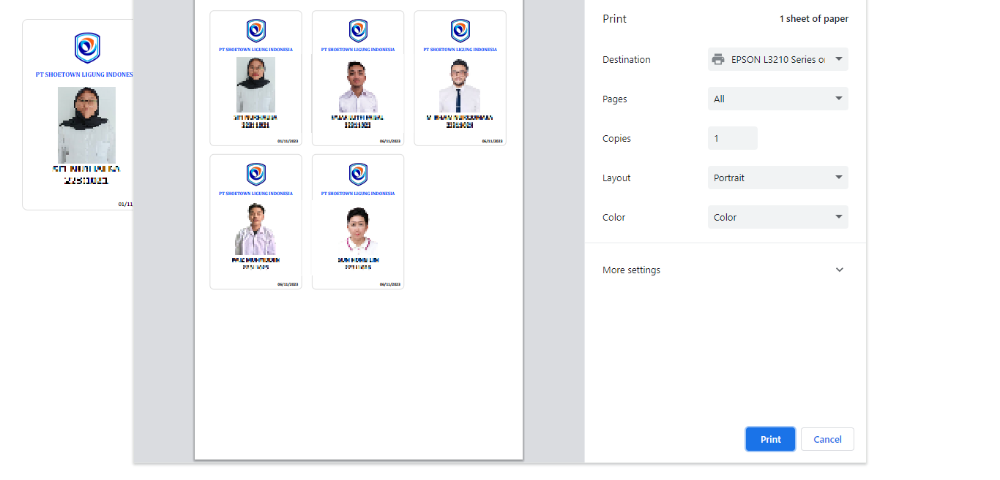
   Image 5.2. - Print preview

  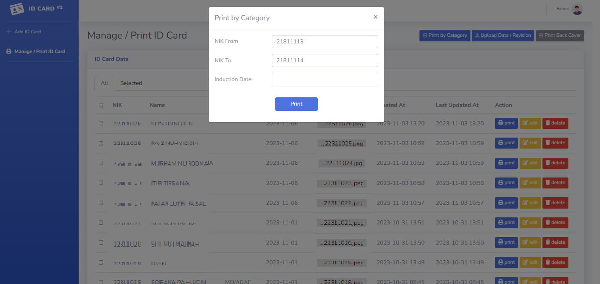
   Image 5.3. - Print by category

## Support and Contact
For any support or feedback, please contact us at mfahmiirfan@gmail.com.
